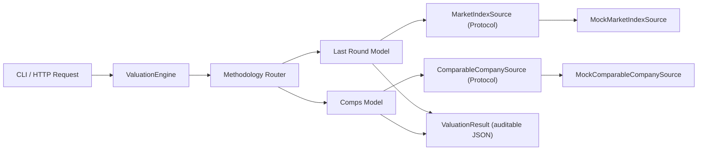

# VC Audit Tool (Take-Home Assignment)

## Overview
This project implements an auditable backend workflow for valuing private VC portfolio companies.

It focuses on consistency, traceability, and maintainability rather than financial-model precision.
Each valuation response includes:
- Estimated fair value
- Inputs used
- Assumptions
- Data citations
- Step-by-step derivation
- Confidence / risk indicators (data freshness, peer-set quality, staleness risk)
- Audit metadata (request ID, timestamp, engine version)

## Chosen Methodologies
The tool supports two methodologies behind a shared valuation engine:

1. Last Round (Market-Adjusted)
- Starts from `last_post_money_valuation`
- Applies change in a selected public index between `last_round_date` and `as_of_date`
- Uses mocked index history (in-memory dataset)
- Reports staleness risk and index data freshness

2. Comparable Company Analysis (Comps)
- Selects public comps by sector or explicit ticker list
- Computes selected EV/Revenue statistic (`median` or `mean`)
- Applies multiple to private company LTM revenue
- Optionally applies private-company discount
- Uses mocked comps data (in-memory dataset)
- Reports peer-set quality and multiple spread

## Why this approach
Design decisions and tradeoffs:
- **Standard library only**: avoids setup friction, but uses a minimal `http.server` API instead of a richer framework.
- **Mocked data sources with explicit citations**: deterministic and reproducible for audit/testing, but not live market-connected.
- **Provider Protocols (PEP 544)**: data sources are typed to `Protocol` interfaces (`MarketIndexSource`, `ComparableCompanySource`), so mock and real providers satisfy the same contract. Swapping in a live Yahoo Finance adapter requires zero changes to business logic.
- **Pluggable methodologies via ABC**: `ValuationMethodology` is an abstract base class with `@abstractmethod`. Adding DCF or custom methods is a one-file addition plus a registration line in `engine.py`.
- **Strict validation and typed models**: catches bad inputs early and keeps outputs structured for downstream audit storage.
- **Confidence indicators**: every valuation includes risk signals (staleness, peer-set quality, data source type) so auditors can assess estimate reliability.
- **Structured logging**: the HTTP server uses Python's `logging` module with configurable verbosity (`--log-level`) and audit-friendly request/response logging.

## Architecture
Workflow: input ingestion → validation → methodology execution → auditable output



## Project Structure
- `src/vc_audit_tool/engine.py`: request orchestration and methodology routing
- `src/vc_audit_tool/models.py`: request/result schema and audit metadata
- `src/vc_audit_tool/interfaces.py`: `Protocol` definitions for data source contracts
- `src/vc_audit_tool/validation.py`: shared parsing + validation helpers
- `src/vc_audit_tool/data_sources.py`: mocked market/comps datasets (implement Protocols)
- `src/vc_audit_tool/exceptions.py`: domain-specific exception hierarchy
- `src/vc_audit_tool/methodologies/base.py`: `ValuationMethodology` ABC + `MethodologyContext`
- `src/vc_audit_tool/methodologies/last_round.py`: last-round market-adjusted model
- `src/vc_audit_tool/methodologies/comps.py`: comparable-company model
- `src/vc_audit_tool/cli.py`: command-line entry point
- `src/vc_audit_tool/server.py`: HTTP JSON API (`POST /value`, `GET /health`) with structured logging
- `src/vc_audit_tool/web.py`: minimal web UI (single-page app + SQLite persistence)
- `src/vc_audit_tool/store.py`: SQLite audit-trail store for past valuation runs
- `tests/test_engine.py`: core engine integration tests
- `tests/test_validation.py`: parser edge-case unit tests
- `tests/test_methodologies.py`: boundary + negative-path tests for both methodologies
- `tests/test_serialization.py`: output schema contract tests
- `tests/test_server.py`: HTTP endpoint integration tests (live server)
- `tests/test_cli.py`: CLI subprocess tests (exit codes, error output)
- `tests/test_interfaces.py`: Protocol conformance verification
- `tests/test_store.py`: SQLite store unit tests
- `tests/test_web.py`: web UI HTTP integration tests
- `examples/*.json`: sample valuation requests
- `.github/workflows/ci.yml`: CI pipeline (lint + type-check + test)

## Setup
### Prerequisites
- Python 3.10+

### Install (editable, with dev tools)
```bash
python3 -m pip install -e ".[dev]"
```

## Usage
### CLI example: last-round valuation
```bash
PYTHONPATH=src python3 -m vc_audit_tool.cli \
  --request-file examples/last_round_request.json \
  --pretty
```

### CLI example: comps valuation
```bash
PYTHONPATH=src python3 -m vc_audit_tool.cli \
  --request-file examples/comps_request.json \
  --pretty
```

### API mode
Start server:
```bash
PYTHONPATH=src python3 -m vc_audit_tool.server --host 127.0.0.1 --port 8080
```

With verbose logging:
```bash
PYTHONPATH=src python3 -m vc_audit_tool.server --host 127.0.0.1 --port 8080 --log-level DEBUG
```

Health check:
```bash
curl http://127.0.0.1:8080/health
```

Valuation request:
```bash
curl -X POST http://127.0.0.1:8080/value \
  -H "Content-Type: application/json" \
  -d @examples/last_round_request.json
```

### Web UI (interactive)
Start the web UI (includes SQLite persistence for past runs):
```bash
PYTHONPATH=src python3 -m vc_audit_tool.web --port 8090
```
Then open **http://127.0.0.1:8090** in your browser.

Features:
- **Editable request form** — select methodology, edit every input field, submit
- **Human-readable report** — fair value, derivation steps, assumptions, citations, confidence indicators
- **Past runs sidebar** — all historical valuations stored in SQLite, click to reload any past report
- **API endpoints** — `POST /api/value` (run + persist), `GET /api/runs` (list), `GET /api/runs/{id}` (detail)

## Input Schema (request)
```json
{
  "company_name": "Basis AI",
  "methodology": "last_round_market_adjusted | comparable_companies",
  "as_of_date": "YYYY-MM-DD",
  "inputs": { "methodology-specific fields": "..." }
}
```

Last-round required inputs:
- `last_post_money_valuation`
- `last_round_date`
- Optional: `public_index` (default `NASDAQ_COMPOSITE`)

Comps required inputs:
- `sector`
- `revenue_ltm`
- Optional: `peer_tickers` (array)
- Optional: `statistic` (`median` default, or `mean`)
- Optional: `private_company_discount_pct` (default `0`)

## Output Schema (high-level)
- `estimated_fair_value`
- `inputs_used`
- `assumptions`
- `citations`
- `derivation_steps`
- `confidence_indicators`
- `audit_metadata`

This makes each valuation transparent and easy to review in an audit file.

## Quality Gates
The project enforces three quality gates, locally and in CI:

```bash
# Lint (ruff)
ruff check src/ tests/

# Format (ruff)
ruff format --check src/ tests/

# Type check (mypy --strict)
mypy

# Tests (106 tests)
PYTHONPATH=src python3 -m unittest discover -s tests -v
```

CI runs all four gates on Python 3.10, 3.12, and 3.13 via GitHub Actions.

## Testing
```bash
PYTHONPATH=src python3 -m unittest discover -s tests -v
```

**106 tests** across 9 test modules covering:
- Validation parser edge cases (None, wrong types, malformed dates, empty strings)
- Boundary behavior (0 values, 100% discounts, same-day round/as-of)
- Negative paths for every methodology input field
- Server integration (bad JSON, wrong routes, empty bodies, correct status codes)
- CLI behavior (missing files, malformed JSON, exit codes, pretty-print)
- Serialization contract (schema key stability, type guarantees, version consistency)
- Protocol conformance (mock sources satisfy interface contracts)
- SQLite store (save, list, get, ordering, limits)
- Web UI HTTP layer (routes, round-trip persist, error handling)

## Potential Improvements (if more time)
- Add a third methodology (DCF) with projection file ingestion and scenario support.
- Implement real data-source adapters behind the existing Protocol interfaces (e.g., Yahoo Finance, Bloomberg) with caching and retry logic.
- Add user/authn and role-based controls for audit teams.
- Add hash-chain or signed-payload support for tamper-evident valuation records.
- Methodology versioning to guarantee reproducibility of historical valuations.
- Side-by-side comparison view in the web UI (run multiple methodologies for the same company).
